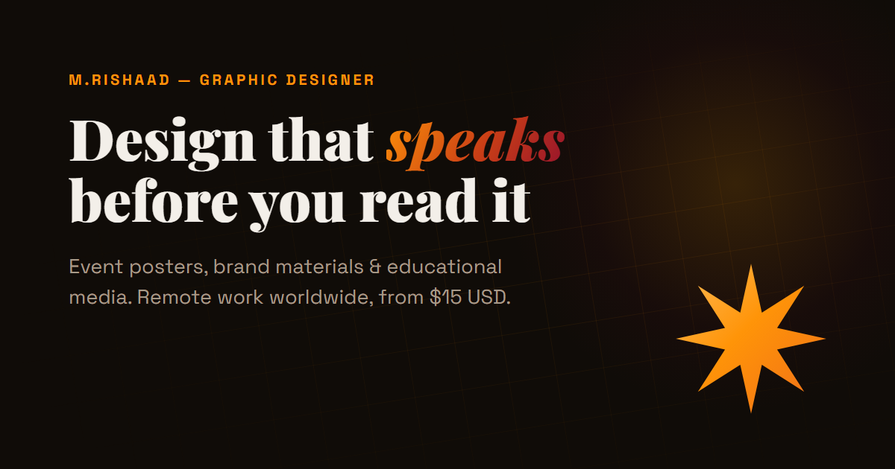

# Mohammad Rishaad | Portfolio

Graphic design and web portfolio: event posters, brand materials, app UI and websites, mostly for Islamic education and community organizations.

**Live site:** https://mohammadrishaad.github.io/portfolio/

## What's inside

- **Posters:** event, class and campaign posters for community organizations
- **Apps:** An Noor, a UI design for an audio Islamic-lecture app
- **Websites:** client site work, such as the AT-Tayyib Institute website

## Built with

Plain HTML and CSS, no framework or build step. Hosted on GitHub Pages. Images are WebP for fast loading.

## Contact

Use the contact form on the [live site](https://mohammadrishaad.github.io/portfolio/#contact) to start a project.
